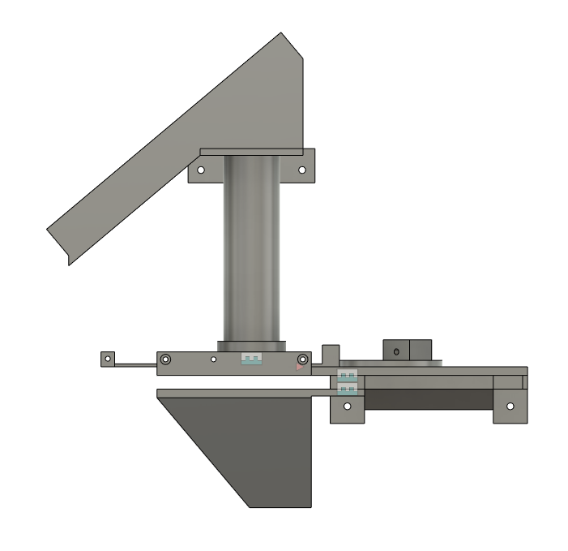
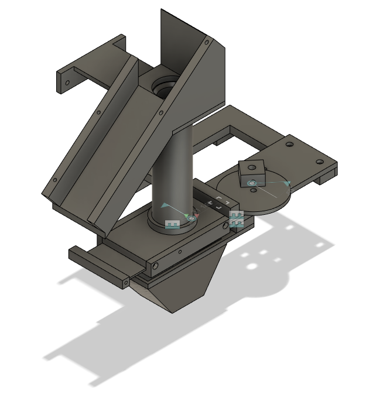

# Spar 7 Alternative Hopper

Here you will find STL files for 3D printing the alternative hopper. STEP-files and a Fusion360 project export are also included (in case you would like to modify the design)

## Notes
1. 4 wooden screws are needed to mount the hopper to the inside plywood wall. Make sure to use short screws, so you don't penetrate the plywood and break the front glass ;)
2. The CAM is for a 6mm shaft motor. It is secured to the shaft using an M4 screw
3. Assembling thw hopper requires M3 6mm screws, M3 15 and 20mm screws
4. The payout slide requires two soft springs (approx 20mm in length)
5. The motor bracket is designed for a JGB37-500 motor. This can be sourced from AliExpress.

