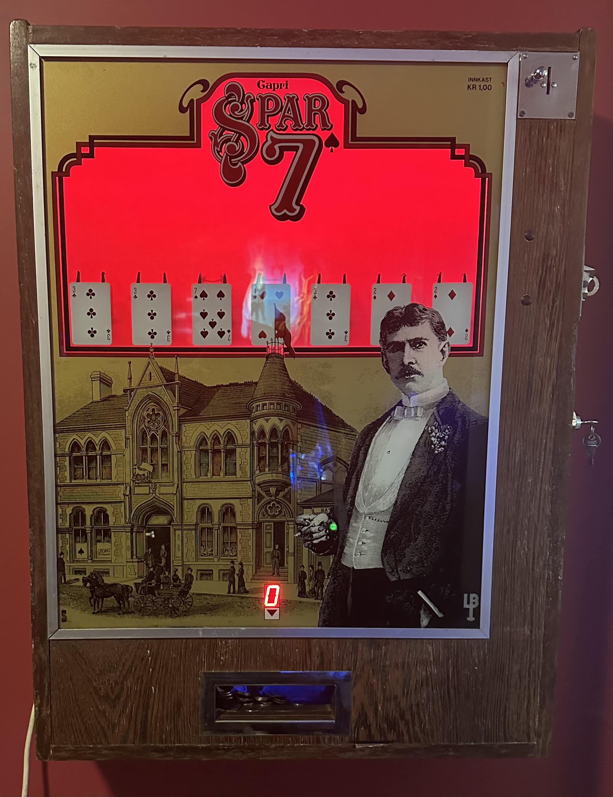
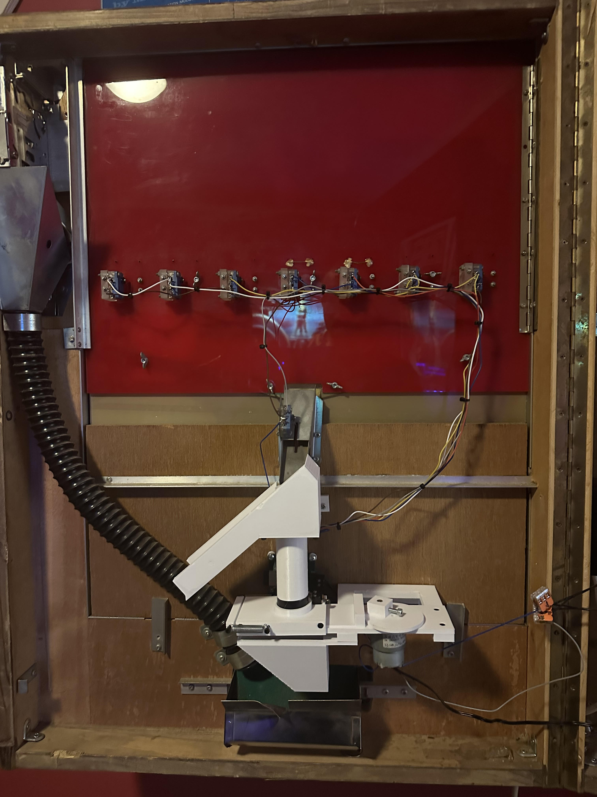
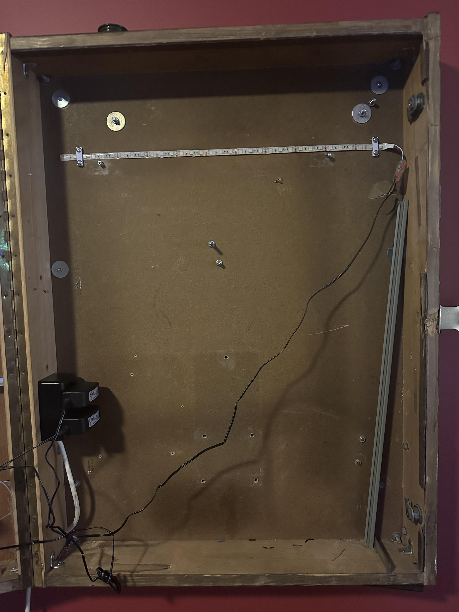

# Spar7 Rewired

This repository contains schematics, PCB layout, gerber files and STEP/STL files necessary for a complete Spar 7 rebuild.

 > **Disclaimer:** This repository contains information about my own rebuild. I can not guarantee that this will work as expected in YOUR game. It is entirely possible that you will break your beautiful collector quality game beyond repair trying to retrofit this board and the 3D printed hopper mechanism. Proceed at your own risk :)

Note: The payout slide is currently made of 1.7mm thick 3D printed plastic. This part will wear out over time, and the life expectancy of this part is currently unknown. A CNC fabricated aluminium/steel sheet with 3D printed endcaps is a better option if this is a convern.

