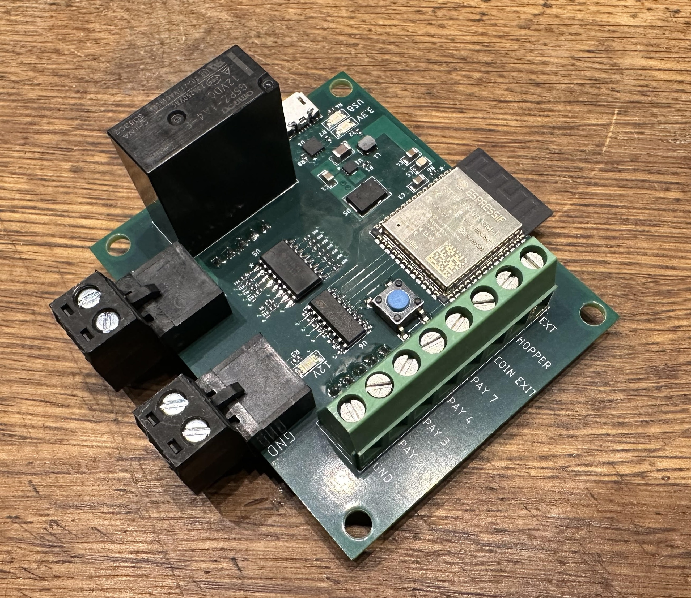

# Eagle files

Here you will find a bill of materials along with eagle project files. Gerber files that can be uploaded to a PCB manufacturer can be found in the CAM folder

## Notes
1. There is no hardware debouncing in this version. A RC filter + schmitt trigger should be added to the inputs if you are planing on using interrupt handlers for the inputs.
2. The relay is rated for higher voltages than 12V, but I would not recommend using this for controlling a line voltage driven AC motor (220V can kill).
3. The 3.3V, 12V and USB leds are a bit on the bright side. Use series resistors with a higher resistance or consider not mounting these LEDs if light leakage to the payout slot is considered annoying.

